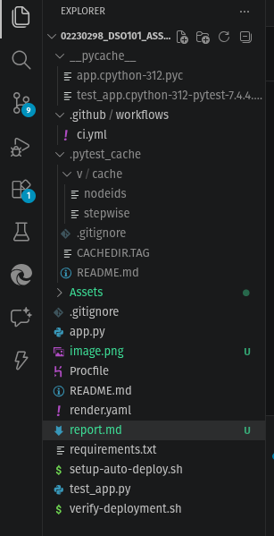
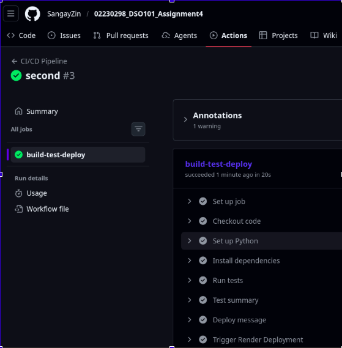
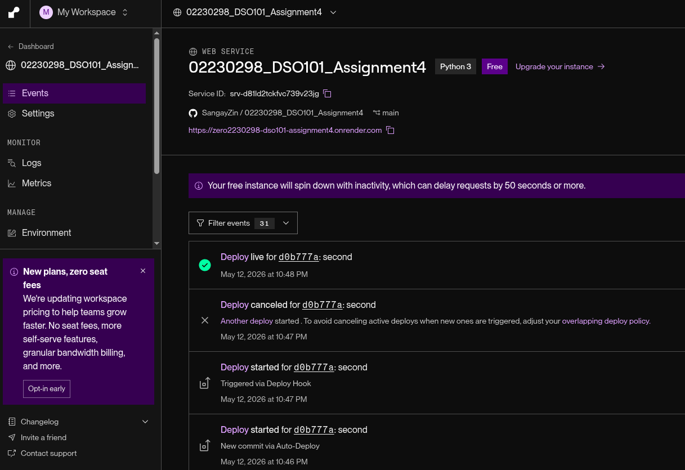
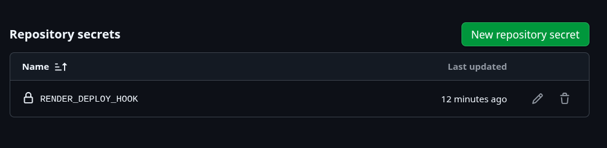
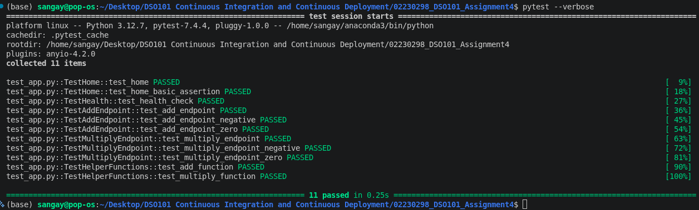
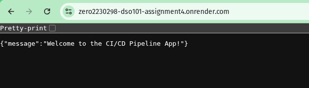
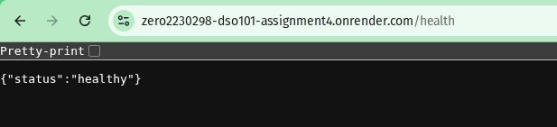
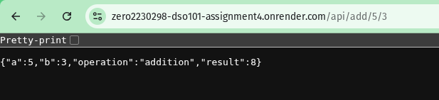

# DSO101 Assignment 4: CI/CD Pipeline Implementation Report

**Student ID:** 02230298  
**Assignment:** Build a Complete CI/CD Pipeline with Testing & Deployment  

---

## 1. Project Overview

The assignment required building a real-world CI/CD pipeline with automated testing and deployment. This implementation uses:

- **Backend Application:** Flask (Python-based REST API)
- **Testing Framework:** pytest (Python unit testing)
- **CI/CD Orchestration:** GitHub Actions
- **Deployment Platform:** Render (cloud hosting service)
- **Version Control:** GitHub

The pipeline automatically runs tests and deploys the application whenever code is pushed to the main branch, ensuring code quality and continuous deployment.

---


## 2. Project Structure




## 3. Implementation Details

### 3.1 Backend Application (app.py)

The Flask application provides a REST API with the following endpoints:

#### Endpoints Implemented:

1. **`GET /`** - Home Endpoint
   - Returns a welcome message
   - Purpose: Verify application is running
   - Response: `{'message': 'Welcome to the CI/CD Pipeline App!'}`

2. **`GET /health`** - Health Check
   - Provides application health status
   - Purpose: Monitoring and health verification
   - Response: `{'status': 'healthy'}`, HTTP 200

3. **`GET /api/add/<int:a>/<int:b>`** - Addition API
   - Adds two numbers using path parameters
   - Example: `/api/add/5/3` returns `8`
   - Purpose: Demonstrate mathematical operations

4. **`GET /api/add`** - Addition with Query Parameters
   - Alternative addition endpoint using query parameters
   - Supports negative numbers
   - Example: `/api/add?a=-5&b=3`
   - Purpose: Flexible parameter passing

#### Features:
- Error handling for invalid inputs
- JSON response format
- RESTful API design
- Clear documentation within code

### 3.2 Dependencies (requirements.txt)

```
Flask==2.3.3        # Web framework
pytest==7.4.2       # Testing framework
gunicorn==21.2.0    # Production WSGI server
```

---

## 4. Testing Strategy

### 4.1 Unit Tests (test_app.py)

Comprehensive test coverage organized into test classes:

#### Test Classes:

1. **TestHome** - Home Endpoint Tests
   - `test_home()`: Verifies correct status code and response format
   - `test_home_basic_assertion()`: Basic arithmetic validation
   - Coverage: Response structure, content validation

2. **TestHealth** - Health Check Tests
   - `test_health_check()`: Validates health endpoint response
   - Coverage: Status code, health status verification

3. **TestAddEndpoint** - API Endpoint Tests
   - `test_add_endpoint()`: Tests addition calculation accuracy
   - Tests path-based parameters
   - Validates mathematical correctness

### 4.2 Test Execution

- **Framework:** pytest
- **Command:** `pytest --verbose`
- **Coverage:** Core application functionality
- **Pass Criteria:** All tests must pass before deployment

Tests use pytest fixtures to create isolated test clients, ensuring clean test environment for each test case.

---

## 5. CI/CD Pipeline Configuration

### 5.1 GitHub Actions Workflow (.github/workflows/ci.yml)

The workflow automates the entire pipeline from code commit to deployment.

#### GitHub Actions Workflow Execution

**Figure 5.1:** CI/CD Pipeline Execution Status



*Screenshot showing the successful "build-test-deploy" workflow run*


#### Trigger Events:
- Push to `main` branch
- Pull requests to `main` branch

#### Pipeline Stages:

1. **Checkout** - Code retrieval
   - Uses `actions/checkout@v3`
   - Fetches latest code from repository

2. **Setup Python** - Environment preparation
   - Uses `actions/setup-python@v4`
   - Configures Python 3.9 environment

3. **Install Dependencies** - Package installation
   - Upgrades pip
   - Installs packages from `requirements.txt`
   - Command: `pip install -r requirements.txt`

4. **Run Tests** - Quality assurance
   - Executes pytest with verbose output
   - Command: `pytest --verbose`
   - **Critical:** Deployment only proceeds if tests pass

5. **Test Summary** - Execution report
   - Runs regardless of test results (`if: always()`)
   - Confirms test completion status

6. **Deploy Message** - Deployment notification
   - Triggered only on success (`if: success()`)
   - Logs deployment initiation

7. **Trigger Render Deployment** - Cloud deployment
   - Calls Render webhook via `RENDER_DEPLOY_HOOK` secret
   - Initiates live application update
   - Includes fallback messaging for unconfigured deployments

8. **Verify Deployment** - Post-deployment validation
   - Confirms build and test success
   - Displays live app URL if configured
   - Final status verification

### 5.2 Pipeline Execution Flow

```
Code Push → GitHub → Actions Triggered
           ↓
      Checkout Code
           ↓
      Setup Environment
           ↓
      Install Dependencies
           ↓
      Run Tests
           ↓
    ┌─────┴────┐
    ↓          ↓
  PASS       FAIL
    ↓          ↓
Deploy      Stop (No Deploy)
    ↓
Live App Updated
```

---

## 6. Deployment Configuration

### 6.1 Procfile

```
web: gunicorn app:app
```

- Specifies production web server (gunicorn)
- Render uses this to start the application
- Replaces Flask development server with production-grade server

### 6.2 Render Configuration (render.yaml)



Defines Render service configuration including:
- Service specifications
- Environment variables
- Build and start commands
- Port configuration

### 6.3 Deployment Process

1. **GitHub → Render Webhook**
   - Successful test execution triggers webhook
   - Render receives deployment signal

2. **On Render**
   - Pulls latest code from GitHub
   - Installs dependencies
   - Starts application with gunicorn
   - Exposes on public URL

3. **Live Application**
   - Zero-downtime deployment
   - Previous instance replaced with new build
   - All endpoints immediately available

#### Repository Secrets Configuration

**Figure 6.1:** GitHub Repository Secrets



*Screenshot showing configured `RENDER_DEPLOY_HOOK` secret for automatic deployment*

---

## 7. Automated Setup & Verification

### 7.1 Setup Script (setup-auto-deploy.sh)

Automated configuration script that:
- Initializes GitHub Actions workflow
- Configures Render deployment
- Sets up secrets and environment variables
- Validates configuration

### 7.2 Verification Script (verify-deployment.sh)

Deployment validation that:
- Confirms application is running
- Validates all endpoints respond correctly
- Tests API functionality
- Generates deployment report

---


## 8. Lessons Learned

### CI/CD Best Practices
1. **Test Coverage is Critical:** Tests act as gatekeepers preventing broken code from reaching production
2. **Automation Reduces Risk:** Consistent, repeatable processes eliminate human error
3. **Infrastructure as Code:** Workflow definitions enable version control and reproducibility
4. **Secrets Management:** Proper secret configuration ensures secure deployments

### Implementation Insights
1. **Webhook Integration:** Seamless GitHub-Render integration enables true continuous deployment
2. **Environment Parity:** Production server (gunicorn) must match test environment
3. **Status Reporting:** Clear logging at each pipeline stage aids debugging
4. **Graceful Fallbacks:** Handling missing configurations prevents workflow failures

---

## 9. Screenshots & Evidence

### Test Execution Evidence

**Figure 9.1:** Pytest Test Execution



*Screenshot of pytest run showing all tests passing successfully*

### Application Endpoints

**Figure 9.2:** Home Endpoint Response

*Screenshot of GET / endpoint returning welcome message*




**Figure 9.3:** Health Check Endpoint

*Screenshot of GET /health endpoint returning healthy status*




**Figure 9.4:** Addition API Endpoint

*Screenshot of GET /api/add/5/3 endpoint demonstrating API functionality*



---


## 10. Conclusion

I successfully built a complete CI/CD pipeline for this assignment. The project includes:

- A Flask backend with multiple working endpoints
- Unit tests using pytest that cover the main features
- A GitHub Actions pipeline that runs tests automatically
- Automatic deployment to Render whenever tests pass
- Clean code and clear documentation

I made sure to follow DevOps best practices like infrastructure automation, proper testing, and version control. This project helped me understand how real-world CI/CD pipelines work and how to set one up myself.


---

